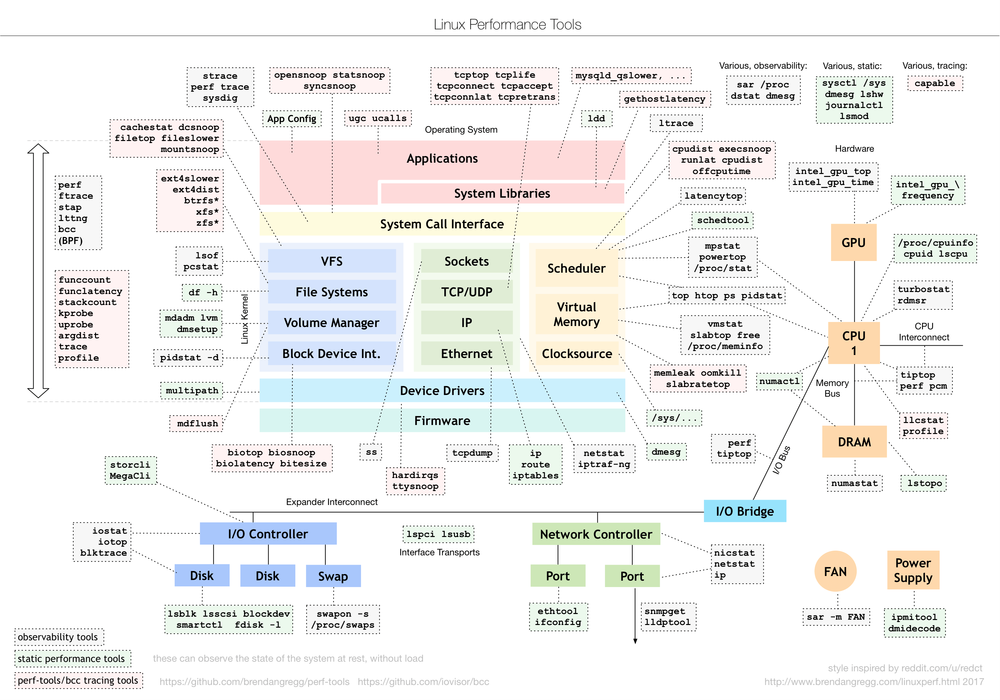

# 开篇

本文为自购的极客时间教程学习笔记，总结其中的干货部分作为日后性能调查的一个大纲。

性能问题为什么这么难呢？我觉得主要是因为性能优化是个系统工程，总是牵一发而动全身。它涉及了从程序设计、算法分析、编程语言，再到系统、存储、网络等各种底层基础设施的方方面面。每一个组件都有可能出问题，而且很有可能多个组件同时出问题。

毫无疑问，性能优化是软件系统中最有挑战的工作之一，但是换个角度看，它也是最考验体现你综合能力的工作之一。如果说你能把性能优化的各个关键点吃透，那我可以肯定地说，你已经是一个非常优秀的软件工程师了。

性能指标是什么？学习性能优化的第一步，一定是了解“性能指标”这个概念。当看到性能指标时，你会首先想到什么呢？我相信“高并发”和“响应快”一定是最先出现在你脑海里的两个词，而它们也正对应着性能优化的两个核心指标——“吞吐”和“延时”。这两个指标是从应用负载的视角来考察性能，直接影响了产品终端的用户体验。跟它们对应的，是从系统资源的视角出发的指标，比如资源使用率、饱和度等。

我们知道，随着应用负载的增加，系统资源的使用也会升高，甚至达到极限。而性能问题的本质，就是系统资源已经达到瓶颈，但请求的处理却还不够快，无法支撑更多的请求。

实说到性能工具，就不得不提性能领域的大师布伦丹·格雷格（Brendan Gregg）。他不仅是动态追踪工具 DTrace 的作者，还开发了许许多多的性能工具。我相信你一定见过他所描绘的 Linux 性能工具图谱：

高清图片来自https://www.brendangregg.com/Perf/linux_perf_tools_full.png

这个图是 Linux 性能分析最重要的参考资料之一，它告诉你，在 Linux 不同子系统出现性能问题后，应该用什么样的工具来观测和分析。比如，当遇到 I/O 性能问题时，可以参考图片最下方的 I/O 子系统，使用 iostat、iotop、blktrace 等工具分析磁盘 I/O 的瓶颈。你可以把这个图保存下来，在需要的时候参考查询。

但是切记，千万不要把性能工具当成学习的全部。工具只是解决问题的手段，关键在于你的用法。只有真正理解了它们背后的原理，并且结合具体场景，融会贯通系统的不同组件，你才能真正掌握它们

技巧一：虽然系统的原理很重要，但在刚开始一定不要试图抓住所有的实现细节。

技巧二：边学边实践，通过大量的案例演习掌握 Linux 性能的分析和优化。

技巧三：勤思考，多反思，善总结，多问为什么。
