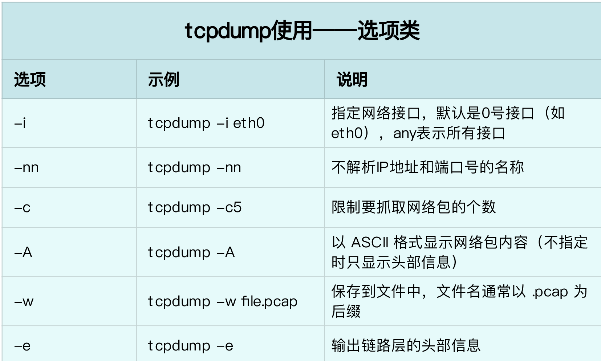

# 网络

TCP/IP 模型，把网络互联的框架分为应用层、传输层、网络层、网络接口层等四层，其中，

应用层，负责向用户提供一组应用程序，比如 HTTP、FTP、DNS 等。

传输层，负责端到端的通信，比如 TCP、UDP 等。

网络层，负责网络包的封装、寻址和路由，比如 IP、ICMP 等。

网络接口层，负责网络包在物理网络中的传输，比如 MAC 寻址、错误侦测以及通过网卡传输网络帧等。

## 性能指标

实际上，我们通常用带宽、吞吐量、延时、PPS（Packet Per Second）等指标衡量网络的性能。

带宽，表示链路的最大传输速率，单位通常为 b/s （比特 / 秒）。

吞吐量，表示单位时间内成功传输的数据量，单位通常为 b/s（比特 / 秒）或者 B/s（字节 / 秒）。吞吐量受带宽限制，而吞吐量 / 带宽，也就是该网络的使用率。

延时，表示从网络请求发出后，一直到收到远端响应，所需要的时间延迟。在不同场景中，这一指标可能会有不同含义。比如，它可以表示，建立连接需要的时间（比如 TCP 握手延时），或一个数据包往返所需的时间（比如 RTT）。

PPS，是 Packet Per Second（包 / 秒）的缩写，表示以网络包为单位的传输速率。PPS 通常用来评估网络的转发能力，比如硬件交换机，通常可以达到线性转发（即 PPS 可以达到或者接近理论最大值）。而基于 Linux 服务器的转发，则容易受网络包大小的影响。

除了这些指标，网络的可用性（网络能否正常通信）、并发连接数（TCP 连接数量）、丢包率（丢包百分比）、重传率（重新传输的网络包比例）等也是常用的性能指标。

这些具体指标的含义，在文档中都有详细的说明，不过，这里有几个跟网络性能密切相关的指标，需要你特别关注一下。

第一，网络接口的状态标志。ifconfig 输出中的 RUNNING ，或 ip 输出中的 LOWER_UP ，都表示物理网络是连通的，即网卡已经连接到了交换机或者路由器中。如果你看不到它们，通常表示网线被拔掉了。

第二，MTU 的大小。MTU 默认大小是 1500，根据网络架构的不同（比如是否使用了 VXLAN 等叠加网络），你可能需要调大或者调小 MTU 的数值。

第三，网络接口的 IP 地址、子网以及 MAC 地址。这些都是保障网络功能正常工作所必需的，你需要确保配置正确。

第四，网络收发的字节数、包数、错误数以及丢包情况，特别是 TX 和 RX 部分的 errors、dropped、overruns、carrier 以及 collisions 等指标不为 0 时，通常表示出现了网络 I/O 问题。其中

：errors 表示发生错误的数据包数，比如校验错误、帧同步错误等；

dropped 表示丢弃的数据包数，即数据包已经收到了 Ring Buffer，但因为内存不足等原因丢包；

overruns 表示超限数据包数，即网络 I/O 速度过快，导致 Ring Buffer 中的数据包来不及处理（队列满）而导致的丢包；

carrier 表示发生 carrirer 错误的数据包数，比如双工模式不匹配、物理电缆出现问题等；collisions 表示碰撞数据包数。

## 套接字信息

ifconfig 和 ip 只显示了网络接口收发数据包的统计信息，但在实际的性能问题中，网络协议栈中的统计信息，我们也必须关注。你可以用 netstat 或者 ss ，来查看套接字、网络栈、网络接口以及路由表的信息。

我个人更推荐，使用 ss 来查询网络的连接信息，因为它比 netstat 提供了更好的性能（速度更快）。

比如，你可以执行下面的命令，查询套接字信息：
```bash
# head -n 3 表示只显示前面3行
# -l 表示只显示监听套接字
# -n 表示显示数字地址和端口(而不是名字)
# -p 表示显示进程信息
$ netstat -nlp | head -n 3

# -l 表示只显示监听套接字
# -t 表示只显示 TCP 套接字
# -n 表示显示数字地址和端口(而不是名字)
# -p 表示显示进程信息
$ ss -ltnp | head -n 3
```

其中，接收队列（Recv-Q）和发送队列（Send-Q）需要你特别关注，它们通常应该是 0。当你发现它们不是 0 时，说明有网络包的堆积发生。当然还要注意，在不同套接字状态下，它们的含义不同。

当套接字处于连接状态（Established）时，Recv-Q 表示套接字缓冲还没有被应用程序取走的字节数（即接收队列长度）。而 Send-Q 表示还没有被远端主机确认的字节数（即发送队列长度）。

当套接字处于监听状态（Listening）时，Recv-Q 表示全连接队列的长度。而 Send-Q 表示全连接队列的最大长度。

所谓全连接，是指服务器收到了客户端的 ACK，完成了 TCP 三次握手，然后就会把这个连接挪到全连接队列中。这些全连接中的套接字，还需要被 accept() 系统调用取走，服务器才可以开始真正处理客户端的请求。与全连接队列相对应的，还有一个半连接队列。所谓半连接是指还没有完成 TCP 三次握手的连接，连接只进行了一半。服务器收到了客户端的 SYN 包后，就会把这个连接放到半连接队列中，然后再向客户端发送 SYN+ACK 包。

# 协议栈统计信息

```bash
netstat -s
ss -s
```

# 网络吞吐和 PPS

给 sar 增加 -n 参数就可以查看网络的统计信息，比如网络接口（DEV）、网络接口错误（EDEV）、TCP、UDP、ICMP 等等。执行下面的命令，你就可以得到网络接口统计信息：

```bash
sar -n DEV 1
```

这儿输出的指标比较多，我来简单解释下它们的含义。

rxpck/s 和 txpck/s 分别是接收和发送的 PPS，单位为包 / 秒。

rxkB/s 和 txkB/s 分别是接收和发送的吞吐量，单位是 KB/ 秒。

rxcmp/s 和 txcmp/s 分别是接收和发送的压缩数据包数，单位是包 / 秒。

%ifutil 是网络接口的使用率，即半双工模式下为 (rxkB/s+txkB/s)/Bandwidth，而全双工模式下为 max(rxkB/s, txkB/s)/Bandwidth。

其中，Bandwidth 可以用 ethtool 来查询，它的单位通常是 Gb/s 或者 Mb/s，不过注意这里小写字母 b ，表示比特而不是字节。我们通常提到的千兆网卡、万兆网卡等，单位也都是比特。如下你可以看到，我的 eth0 网卡就是一个千兆网卡：

```bash
ethtool eth0 | grep Speed Speed: 1000Mb/s
```

```bash
# -c3表示发送三次ICMP包后停止
ping -c3 114.114.114.114
```

## DNS解析问题

```bash
cat /etc/resolv.conf

nslookup time.geekbang.org


# +trace表示开启跟踪查询
# +nodnssec表示禁止DNS安全扩展
dig +trace +nodnssec time.geekbang.org
```

## tcpdump

为了帮你更快上手 tcpdump 的使用，我在这里也帮你整理了一些最常见的用法，并且绘制成了表格，你可以参考使用。



接下来，我们再来看常用的过滤表达式。刚刚用过的是 udp port 53 or host 35.190.27.188 ，表示抓取 DNS 协议的请求和响应包，以及源地址或目的地址为 35.190.27.188 的包。其他常用的过滤选项，我也整理成了下面这个表格。


可以用以下两种方法，来限制 syn 包的速率：

```bash

# 限制syn并发数为每秒1次
$ iptables -A INPUT -p tcp --syn -m limit --limit 1/s -j ACCEPT

# 限制单个IP在60秒新建立的连接数为10
$ iptables -I INPUT -p tcp --dport 80 --syn -m recent --name SYN_FLOOD --update --seconds 60 --hitcount 10 -j REJECT
```

## NAT

### SNAT
为一个子网统一配置 SNAT，并由 Linux 选择默认的出口 IP。这实际上就是经常说的 MASQUERADE：


$ iptables -t nat -A POSTROUTING -s 192.168.0.0/16 -j MASQUERADE

第二种方法，是为具体的 IP 地址配置 SNAT，并指定转换后的源地址：


$ iptables -t nat -A POSTROUTING -s 192.168.0.2 -j SNAT --to-source 100.100.100.100

### DNAT

再来看 DNAT，显然，DNAT 需要在 nat 表的 PREROUTING 或者 OUTPUT 链中配置，其中， PREROUTING 链更常用一些（因为它还可以用于转发的包）。


$ iptables -t nat -A PREROUTING -d 100.100.100.100 -j DNAT --to-destination 192.168.0.2

